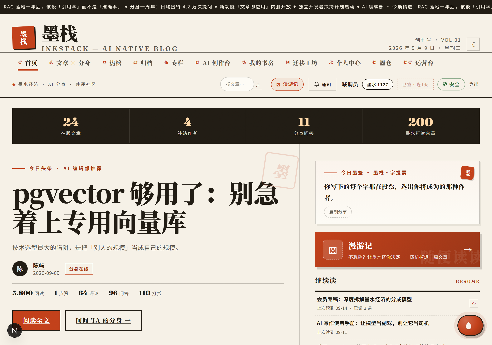
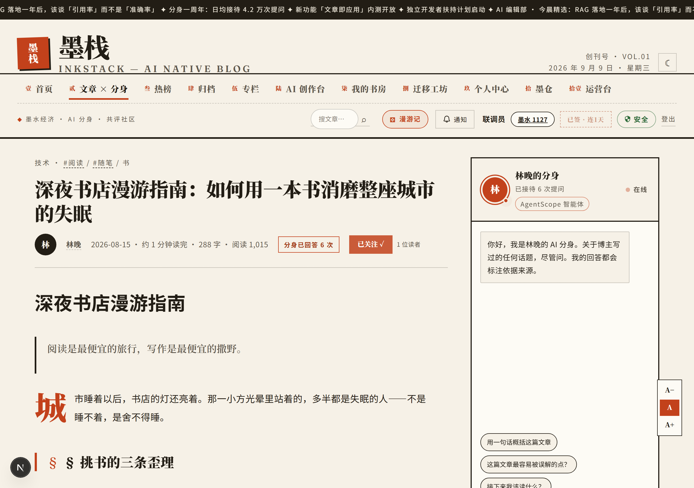
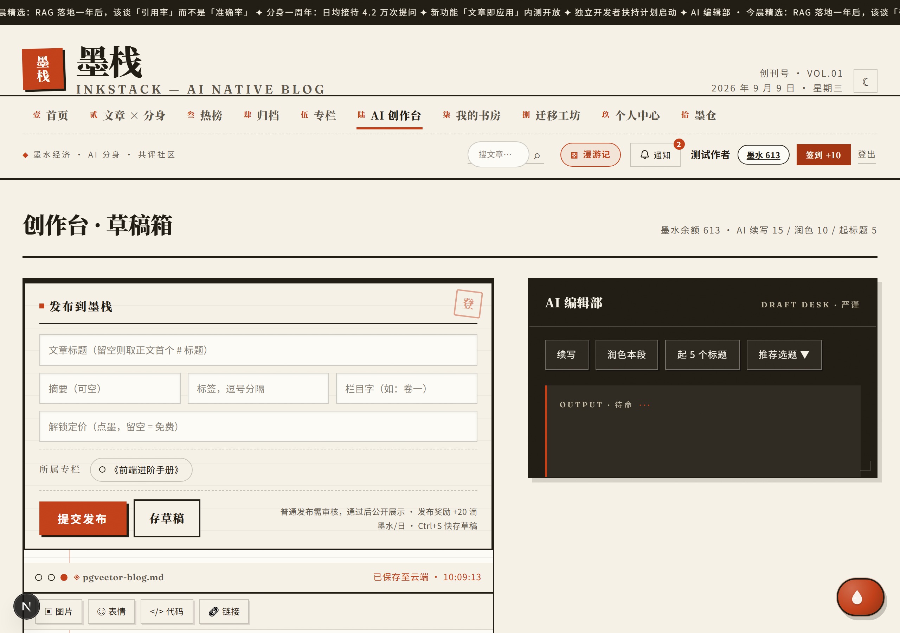
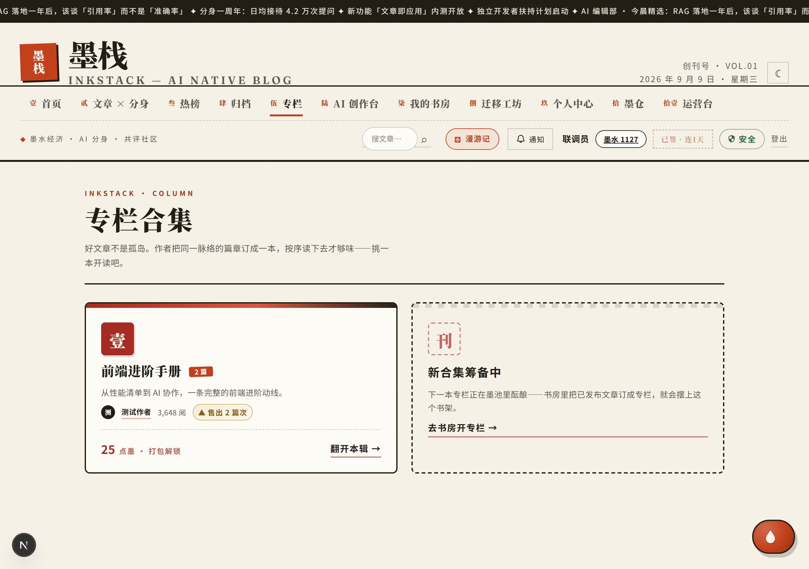
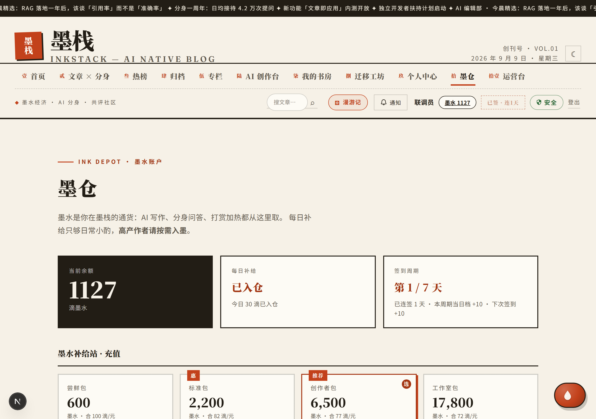
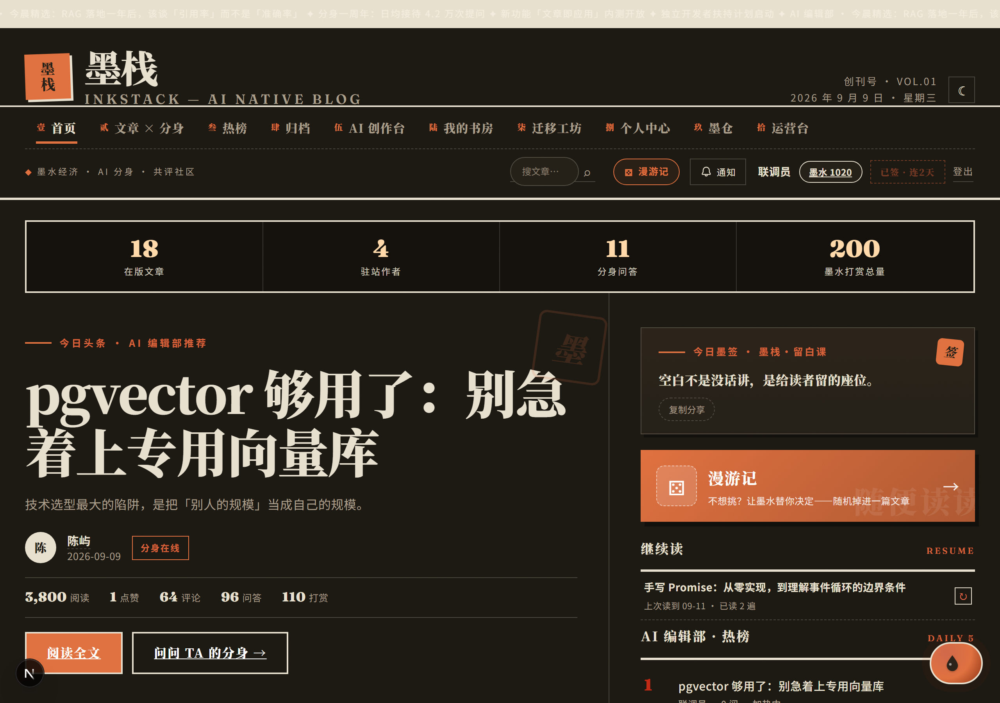
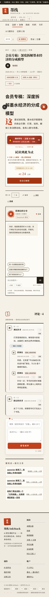

# 墨栈 InkStack · AI 原生博客平台

**简体中文** · [English](.github/README.md)

> 博主有 AI 分身、读者能和文章对话、创作能变现、平台自己会运营。
> 一套用 Next.js 15 写完前后端的个人博客/内容社区，自带杂志编辑风设计系统。

> GitHub 镜像仓库：https://github.com/Dujiang777/InkStack-Next

## 🖼 效果预览

| 首页 · 杂志信息流 | 文章页 · AI 分身问答 |
|---|---|
|  |  |

| AI 创作台 | 专栏合集 |
|---|---|
|  |  |

| 墨仓 · 墨水经济 | 夜间模式 |
|---|---|
|  |  |

<p align="center">
  <br/>
  <sub>手机版 · 底部墨条拇指导航</sub>
</p>

## ✨ 功能总览

### 创作与阅读
- **杂志信息流首页**：重力排序（互动热度 × 时间衰减），支持 boost 加热加权
- **文章页**：Markdown 渲染、代码复制、阅读进度条、目录滚动高亮、上下篇导航
- **AI 创作台**：续写 / 润色 / 起标题 / 推荐选题（DeepSeek 驱动，按积分扣费）
- **专栏合集**：系列文章管理 + 打包一口价购买
- **每周墨报 /weekly**：全站周报自动聚合
- **全站搜索 / 热榜 / 归档 / 标签墙 / 随机漫游**

### AI 分身（AgentScope）
- 每位博主一个 **ReAct 智能体分身**，读者可和「文章本人」对话
- NDJSON 流式输出，demo / live 双模式自动切换
- RAG 检索博主文章（MySQL ngram 全文索引），回答带引用
- Python FastAPI 智能体服务（`agent-service/`），未启动时自动回落 Node 内置模式

### 墨水经济（积分商业化）
- 充值（墨点）/ 打赏（90/10 分账）/ 付费解锁（70/30 分账）/ 专栏打包价
- 限时折扣、加热 boost、解锁销量热度横幅、付费转化漏斗看板
- 所有资金操作**单事务原子化**（占位判重 → FOR UPDATE 扣款 → 同事务分账流水）

### 社区与共评
- 注册/登录（邮箱验证码）、评论点赞、举报流转、审核工作流（pending → approved）
- 作者发布免审（按角色）、运营台评论区管理

### 安全层（v13.5+ 全套）
- scrypt 加盐密码哈希 + HMAC-SHA256 签名会话 Cookie + 数据库会话表双保险
- TOTP 两步验证（手写 RFC 6238，零外部依赖）+ 一次性备份码
- 全站 API 限流（120 req/min）、CSP/COOP/CORP/HSTS 安全响应头
- HIBP 泄露密码检查（fail-open）、新设备登录邮件提醒、忘记密码全端下线
- 安全中心 /security：设备管理、改密、2FA、审计事件时间线
- SQL 全参数化 + XSS 过滤（DOMPurify）+ LIKE 通配符转义 + 全站入参类型归一（类型混淆不再产生 5xx）

### 角色体系与运营台
- 角色：`developer > admin > author > reader`，全站统一 `isStaff()` 判定
- 运营台 /admin 八大页签：总览 / 审核 / 内容（含改价）/ 用户（含角色管理）/ 举报 / 日志 / 评论 / 资金流水
- 角色管理仅 developer 可操作；资金流水 UNION ALL 汇总所有收支

### 多端适配
- 桌面 / 手机双版式（`body.m` 手机版体系 + 底部拇指导航墨条）
- 夜间主题全站覆盖（`data-theme` 驱动）、手动版式切换
- `prefers-reduced-motion` 下全部动效自动关闭

## 🛠 技术栈

| 层 | 选型 |
|---|---|
| 前端 + 后端 | Next.js 15（App Router）+ React 19 + TypeScript |
| 数据库 | MySQL 8（mysql2 直连，无 ORM；全局连接池防热重载泄漏） |
| AI 智能体 | Python FastAPI + AgentScope 1.x + DeepSeek（`agent-service/`） |
| 邮件 | nodemailer（SMTP） |
| 安全 | node:crypto 手写 scrypt / HMAC / TOTP，零外部认证依赖 |

## 🚀 快速开始

环境要求：Node.js ≥ 20、MySQL ≥ 8（不配数据库也能以演示模式启动）。

```bash
# 1. 安装依赖
npm install

# 2. 启动（未配置 DATABASE_URL 时自动使用内置演示数据）
npm run dev        # http://localhost:3100
```

### 接入 MySQL

```bash
# 1. 建库建表（含 ngram 全文索引）
mysql -u root -p < db/schema.sql

# 2. 配置环境变量
cp .env.example .env    # 填入你的数据库密码

# 3. 写入演示文章
npm run seed

# 4. 重启
npm run dev
```

### 启动 AI 智能体服务（可选，推荐）

```bash
cd agent-service
python -m venv .venv
.venv\Scripts\activate            # Windows；Linux/macOS 用 source .venv/bin/activate
pip install -r requirements.txt
cp .env.example .env              # 填 DEEPSEEK_API_KEY + 数据库密码
python main.py                    # http://127.0.0.1:8100
```

根目录 `.env` 配置 `AGENT_SERVICE_URL=http://127.0.0.1:8100` 后，分身问答自动透传到
AgentScope ReActAgent；服务未启动时自动回落 Node 内置模式。
详见 `docs/AgentScope集成方案.md`。

### 提升管理员 / 开发者

```bash
# 创建管理员账号（密码走命令行参数，脚本内不保留任何默认口令）
node scripts/make-admins.mjs --admin=你的邮箱=你的强密码=管理员昵称

# 将已有用户提升为 developer（最高权限，可管理角色）
node scripts/make-admins.mjs --dev-email=某邮箱@xx.com
```

或在数据库中直接更新：`UPDATE users SET role='admin' WHERE email='你的邮箱';`

## ⚙️ 环境变量

全部变量及说明见 [`.env.example`](.env.example)，要点：

| 变量 | 说明 |
|---|---|
| `DATABASE_URL` | MySQL 连接串；不配则演示模式 |
| `SESSION_SECRET` | 会话签名密钥，生产环境必填强随机值 |
| `NEXT_PUBLIC_SITE_URL` | 站点对外地址（sitemap / OAuth 回调依赖） |
| `TRUST_PROXY` | 反向代理后设为 1，限流/审计才取真实 IP |
| `AGENT_SERVICE_URL` | Python 智能体服务地址 |
| `GITEE/GITHUB/QQ_CLIENT_*` | OAuth 登录（可选） |
| `SMTP_*` | 邮箱验证码发信通道（可选） |
| `WECHAT_PAY_*` | 微信支付商户凭证（可选） |

## 📦 生产部署

完整部署手册见 [`DEPLOY.md`](DEPLOY.md)（MySQL 建库 / 环境变量清单 / 反向代理 /
pm2 守护 / 上线前体检清单）。

生产要点速记：
- `next build && next start`（默认端口 3100），Caddy / nginx 反代 80 → 3100
- 反代后必须设 `TRUST_PROXY=1`，否则限流可被伪造头绕过
- 绝对重定向 / OAuth 回调用 `NEXT_PUBLIC_SITE_URL` 拼，不要信 `req.url`
- 生产环境漏配 SMTP 不会回显验证码（devCode 仅非生产可用）

## 🗂 目录结构

```
inkstack/
├── app/                    # Next.js App Router（页面 + API 路由）
│   ├── page.tsx            # 首页杂志信息流
│   ├── article/[slug]/     # 文章页 + 分身问答 + 评论区
│   ├── studio/             # AI 创作台
│   ├── series/ weekly/ hot/ search/ archive/ tag/ ...
│   ├── security/           # 安全中心（设备管理 / 2FA / 审计时间线）
│   ├── admin/              # 运营台（8 页签）
│   └── api/                # auth / articles / agent / ai / admin / ...
├── agent-service/          # ⭐ AgentScope 智能体服务（Python · FastAPI）
├── components/             # Masthead / AdminConsole / AgentChat / CommentsSection ...
├── lib/                    # auth / data / points / rag / db / mailer / totp ...
├── db/schema.sql           # 建表脚本（含 ngram 全文索引）
└── scripts/                # 种子数据 / 运维脚本
```

## 🎨 设计系统

- 方向：**杂志编辑风** —— 规则线 / 编号排版 / 首字下沉 / 朱砂印章 / 竖排题字
- 主色：暖纸底 `#F6F1E7` · 近黑 `#211C14` · 朱砂强调 `#C2401A`
- 展示字：思源宋体 + Fraunces；正文：思源黑体
- 全部设计令牌集中在 `app/globals.css`，CSS 分层追加、不重构旧层

## 📄 License

[MIT](LICENSE)
